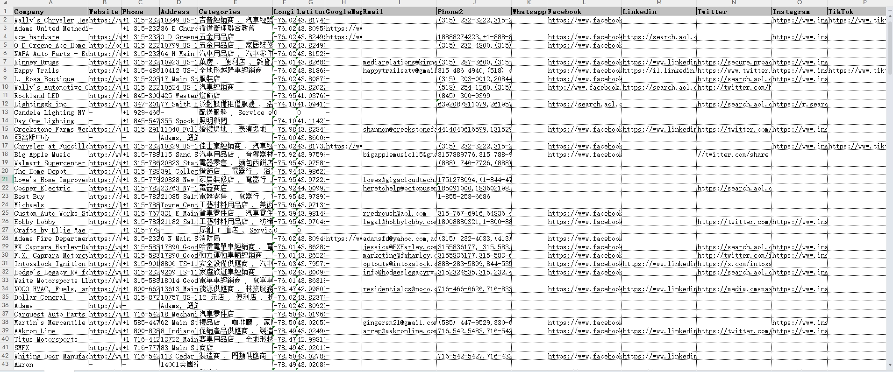

# Google 地图全自动采集软件

是否还在为手动从 Google 地图复制粘贴客户信息到 Excel 而感到枯燥和低效？  

**Google 地图全自动采集软件** 将彻底解放您的双手，让数据获取变得高效、精准、智能。  

Google 地图覆盖全球数以亿计的企业与商户信息，是外贸企业和跨境卖家开发客户的重要资源。借助本工具，您只需输入关键词并设置搜索条件，其余的筛选、翻页、采集与导出全部自动完成，真正做到 **一次搜索，全网尽览**。  

---

## 功能截图

## 数据截图

---

## 产品简介
本软件内置高性能 Chrome 内核浏览器，完美兼容各国/各地区的 Google 地图版本。  

支持使用 Google 地图原生的搜索过滤器，实现精准定位目标客户。系统将自动提取以下关键信息：  

- Google 地图链接  
- 公司名称与地址  
- 电话号码  
- 官方网站链接  
- 经纬度坐标  
- 行业类别标签  
- 网页中的社交媒体信息（WhatsApp、Email、Facebook、LinkedIn 等）  

所有采集结果可一键导出为 `.xlsx` 文件，方便在 Excel 或 CRM 系统中直接查看与管理。  
**不限制导出次数与数量。**

---

## 核心功能亮点
- **自动采集流程**：软件自动完成搜索、翻页、进入详情页、提取信息，无需人工干预。  
- **精准搜索过滤**：支持 Google 地图的所有筛选功能，助力快速锁定目标客户群体。  
- **高并发处理**：支持多任务并发采集，速度更快，可深入抓取官网及二级页面。  
- **智能行为仿真**：内置拟人化延迟与点击逻辑，模拟真实用户操作，有效降低风控与封号风险。  
- **本地数据存储**：所有采集数据均存储在本地，保障私密性与数据安全。  
- **Excel 一键导出**：便捷的数据输出格式，助力后续客户跟进、营销与分析。  

---

## 应用场景
- 外贸企业拓展海外客户名录  
- 跨境电商卖家获取潜在合作商家联系方式  
- 旅游、地产、教育等行业进行市场调研与数据分析  
- 销售团队快速构建目标客户数据库  

---

## 联系方式
软件提供商   WakaSoft

网站  https://www.wakasoft.com/

邮箱  wakasoft.team@gmail.com

---

